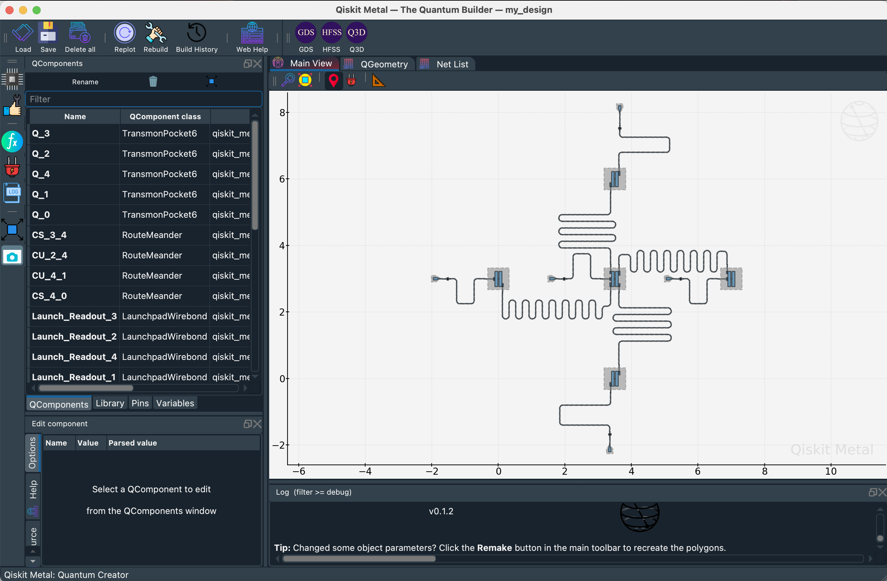

# MQHAD

- Framework to encapsulate application-driven quantum hardware architecture
- A reference implementation of the framework is provided in this repository
  - Modular and easily extensible
  - Providing a basis for future iteration to plug different implementation of each phase of the framework
  
## Key phases

1. Architecture generator - Generates an optimized high-level architecture based on a quantum application - High-level architecture contains the layout of the qubits and qubit frequency
2. Physical layout designer - Maps the high-level architecture to physical layout tools
3. Statistical model - Trained separately from design flow - based on simulation data collected - stand-in for expensive simulation
4. Optimizer - optimizes layout using statistical model created in (3). Usual layout process needs iterative simulation and adjustment of geometries - statistical model can give geometrical value for a targeted parameter without needing iterative simulation and design

## Repository structure

1. mqhad
   1. architecture_generator
      1. bus - generates buses between qubits
      2. chip - creates temporary chip for simulation - temporary chip is a subgraph of the layout graph
      3. frequency - generates frequency of qubits using Monte Carlo simulation - chooses frequency configuration based on maximum yield rate
      4. layout - generates matrix of qubit layout
      5. profile - generates profiles of quantum application:
         1. two qubit gate map - control and target
         2. connectivity degree of qubits
         3. adjacency matrix of qubit
      6. yieldsimulator - uses temporary chip created using chip module to calculate yield rate - yield rate is the number of sub-graphs with no frequency collision divided by the number of trials
   2. designer - maps architecture generator layout to Metal design
      1. canvas - design space
      2. capacitor - creates capacitors
      3. capacitor_launchpad_connector - generates capacitor to launchpad connectors
      4. launchpad - created readouts (launchpads)
      5. qubit - creates qubits
      6. qubit_capacitor_connector - creates qubit to capacitor connections
      7. qubit_connector - creates qubit-to-qubit connections
   3. optimizer - optimizes geometries of layout to hit target parameters
2. notebooks - train statistical model to be stand-in for simulation - used by optimizer

## Trying reference implementation

### Installation

#### Installing Package

1. Clone the repository - `git clone {URL}`

2. Change to cloned directory - `cd mqhad`

3. The easiest way to install the toolkit without affecting other packages is to create a virtual environment, i.e: using conda, as following. Else, you can just run `python -m pip install -e .`. Do note that MQHAD is tested on Python 3.10.

```text
conda env create -n <env_name> environment.yml
conda activate <env_name>
python -m pip install --no-deps -e .
```

#### Installing Qiskit Metal

1. Install Qiskit Metal following installation instructions at [Qiskit Metal](https://qiskit.org/documentation/metal/installation.html). Refer to the [Pre-existing environment](https://qiskit.org/documentation/metal/installation.html#option-2-a-pre-existing-environment) section.

### Usage

#### Command-line interface (CLI)

```text
Usage:
    mqhad --file-path [PATH_TO_QASM_2.0_FILE] --config-file-path [PATH_TO_CONFIG_FILE]
```

The CLI will generate the high-level architecture of the placement of qubits in a 2D square-lattice and the corresponding qubit frequencies. The Metal GUI is invoked at the end as following where there is an option to save the design as a Python script.



#### Testing the Package

1. There is a test circuit that could be used to test the package. Navigate to `mqhad` directory and execute `mqhad --file-path ./mqhad/tests/test_circuit/circuit1.qasm --config-file-path ./mqhad/tests/test_config/config.yml`

### Development

1. On top of normal installation, install development dependencies using `pip install -r requirements-dev.txt`

### FAQs

- QT Warnings

>From [Qiskit Metal FAQ](https://qiskit.org/documentation/metal/faq.html):
>
>Q: Why am I seeing a critical error from qt about not controlling layer-backing?
>
>A: If you are seeing: CRITICAL [_qt_message_handler]: …. WARNING: Layer-backing can not be explicitly controlled on 10.14 when built against the 10.14 SDK … you are likely running a MAC OS version that has trouble with the libraries. Based on information that is available online, this problem does not appear to have a solution. However, it does not seem like this error affects Qiskit Metal’s functionality. If you find problem with this, you might want to try using an older version of the dependency packages, beginning with lowering your python version to 3.7.x.

